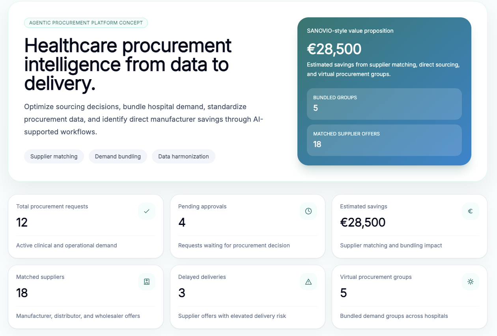
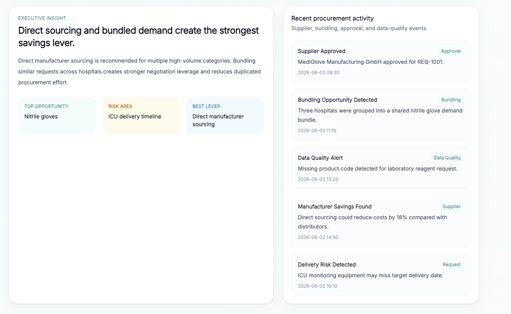
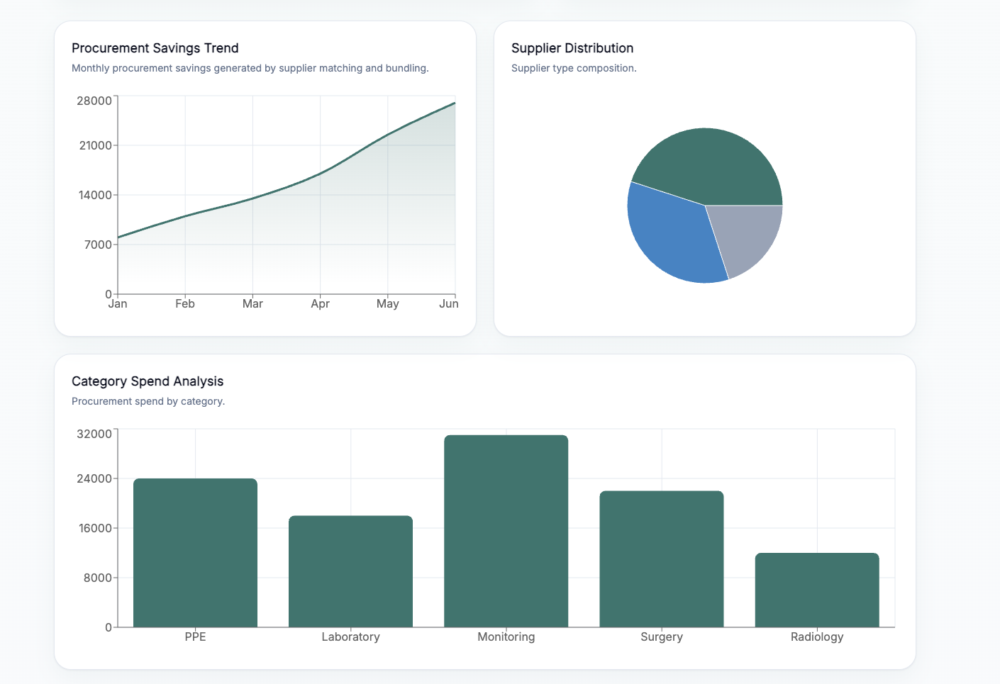
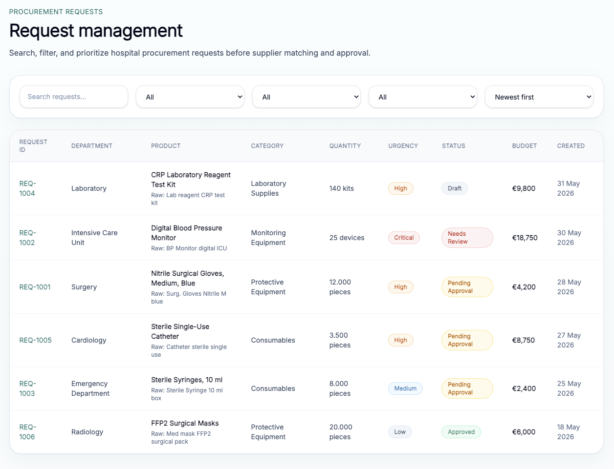
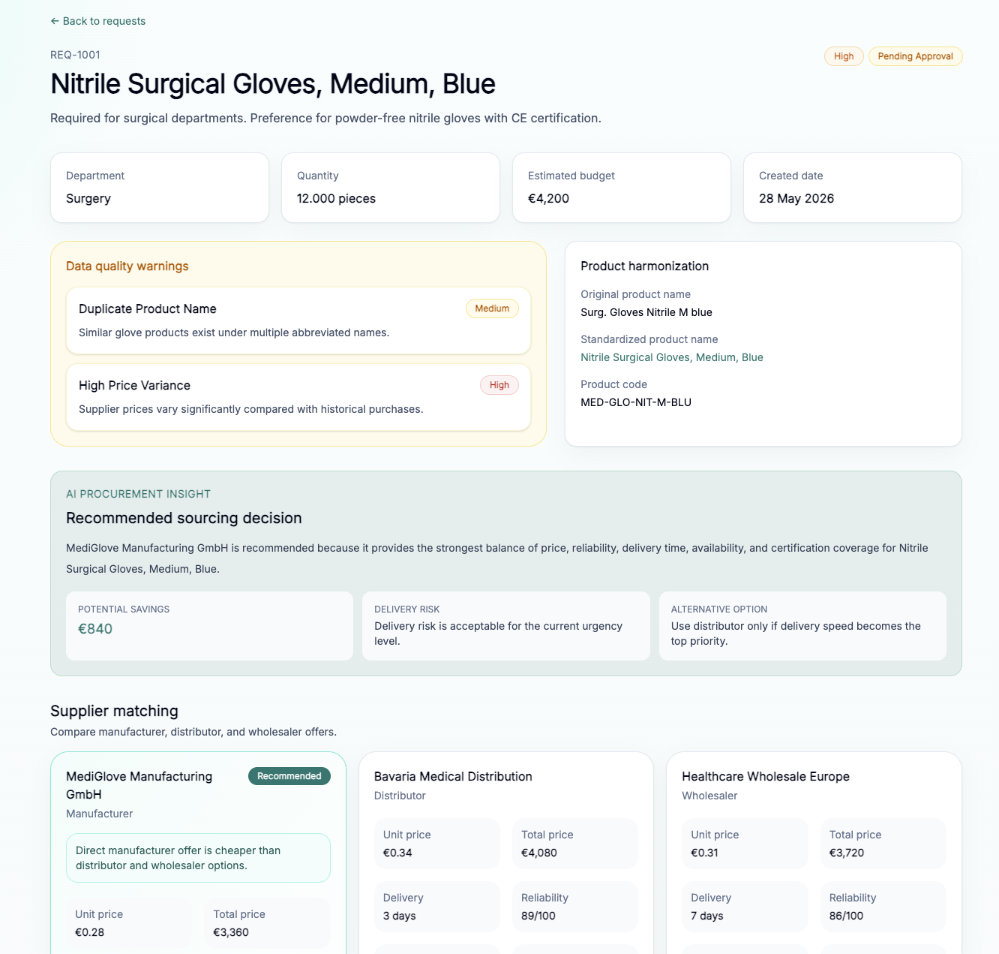
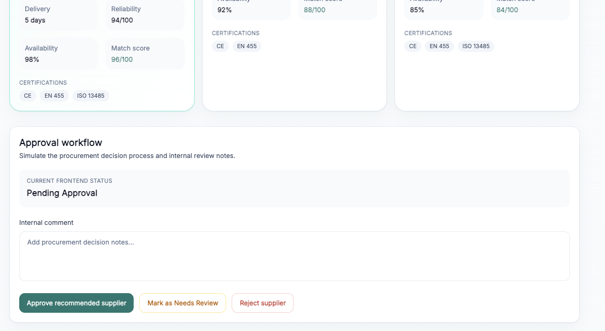
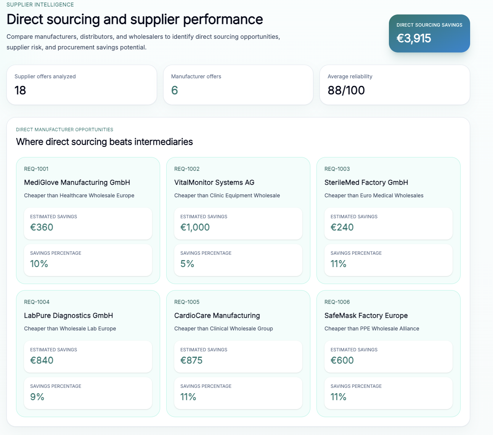
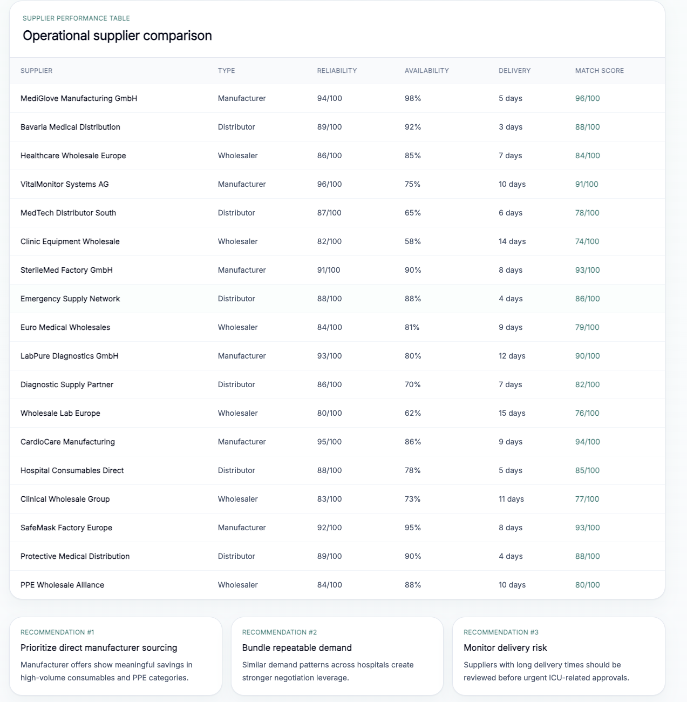
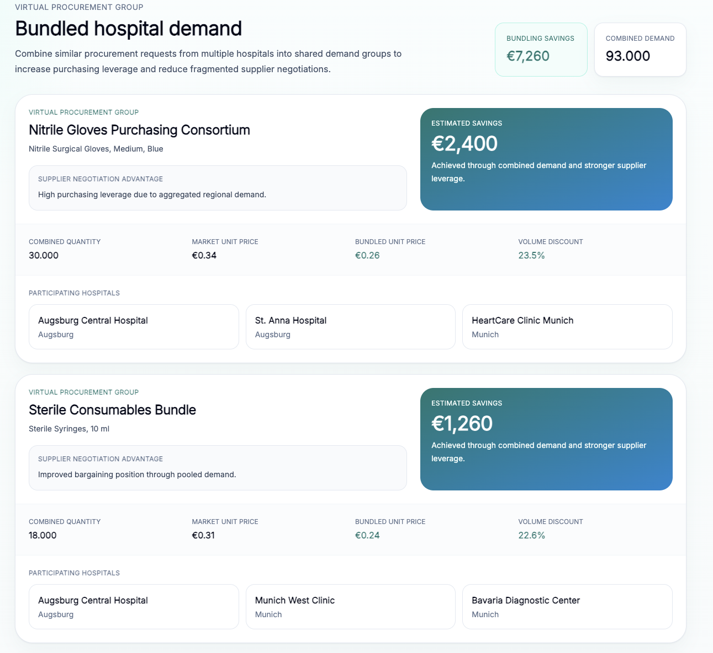
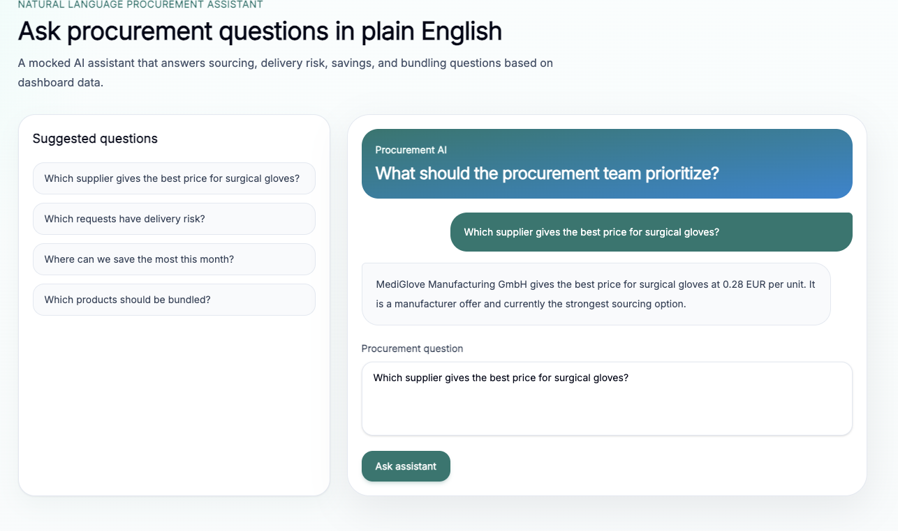

# Healthcare Procurement Intelligence Platform

A full-stack healthcare procurement platform inspired by modern healthcare sourcing workflows and procurement intelligence solutions.

The platform demonstrates how hospitals can reduce procurement costs, standardize fragmented procurement data, improve supplier transparency, identify direct manufacturer sourcing opportunities, and unlock savings through demand bundling and procurement intelligence.

Built with React, TypeScript, Express, React Query, and modern SaaS architecture principles.

---

# Business Problem

Healthcare procurement teams frequently face:

- Inconsistent product naming across departments
- Duplicate procurement requests
- Fragmented supplier ecosystems
- Multiple intermediary suppliers
- Limited visibility into procurement savings
- Delivery delays and fulfillment risks
- Manual approval workflows

These challenges increase procurement costs, reduce operational efficiency, and make strategic sourcing decisions more difficult.

This project demonstrates how a procurement intelligence platform can address these issues through supplier matching, procurement analytics, workflow visibility, and demand aggregation.

---

# Key Business Outcomes

## Direct Manufacturer Sourcing

Identify opportunities where manufacturers outperform distributors and wholesalers.

## Procurement Data Harmonization

Transform inconsistent product descriptions into standardized procurement records.

## Virtual Procurement Groups

Bundle procurement demand across multiple hospitals to increase purchasing leverage and unlock volume discounts.

## Procurement Intelligence

Generate sourcing recommendations based on supplier pricing, reliability, certifications, availability, and delivery performance.

## Workflow Visibility

Track procurement requests from creation through fulfillment using a structured procurement lifecycle.

---

# Features

## Executive Dashboard

Central procurement command center providing:

- Procurement KPIs
- Savings analytics
- Supplier metrics
- Procurement trends
- Executive insights
- Activity monitoring

---

## Procurement Request Management

Hospital procurement requests can be:

- Searched
- Filtered
- Sorted
- Prioritized

Each request contains:

- Department
- Category
- Quantity
- Budget
- Urgency
- Status

---

## Request Intelligence

Each procurement request includes:

### Product Harmonization

Example:

Raw:

Surg. Gloves Nitrile M blue

↓

Standardized:

Nitrile Surgical Gloves, Medium, Blue

### Supplier Matching

Compare:

- Manufacturers
- Distributors
- Wholesalers

Using:

- Price
- Reliability
- Availability
- Delivery Time
- Certifications

### Procurement Recommendation Engine

Provides:

- Recommended Supplier
- Savings Estimation
- Risk Analysis
- Alternative Sourcing Options

---

## Supplier Intelligence

Analyze supplier performance across:

- Reliability
- Availability
- Match Scores
- Delivery Times
- Savings Opportunities

Direct manufacturer sourcing opportunities are automatically identified.

---

## Virtual Procurement Groups

Bundle similar procurement requests from multiple hospitals.

Benefits:

- Larger Purchasing Volume
- Stronger Supplier Negotiation Leverage
- Reduced Procurement Fragmentation
- Lower Unit Prices
- Higher Procurement Savings

---

## Procurement Workflow Management

Track requests through a structured procurement lifecycle.

Request Created

↓

Data Standardized

↓

Demand Bundled

↓

Suppliers Matched

↓

Offer Selected

↓

Fulfillment Started

↓

Delivered

---

## AI Procurement Assistant

Natural-language procurement assistant capable of answering procurement-related questions.

Example questions:

- Which supplier offers the best price?
- Which requests have delivery risk?
- Where can we save the most money?
- Which products should be bundled?

---

## Authentication & Role-Based Access Control

Implemented procurement-specific access control.

### Roles

#### Admin

Full platform access.

#### Procurement Manager

Access to:

- Requests
- Supplier Intelligence
- Virtual Groups
- Data Quality

#### Hospital User

Access to:

- Requests
- Workflow
- Data Quality

#### Supplier Manager

Access to:

- Supplier Intelligence

Protected routes demonstrate Role-Based Access Control (RBAC).

---

# Application Screenshots

## Dashboard Overview

### Executive Dashboard

### Executive Insights & Activity Feed

### Procurement Analytics

---

## Procurement Requests

---

## Request Intelligence

### Product Harmonization & Procurement Recommendation

### Supplier Comparison & Approval Workflow

---

## Supplier Intelligence

### Direct Manufacturer Opportunities

### Supplier Performance Analytics

---

## Virtual Procurement Groups

---

## Procurement Workflow

---

## AI Procurement Assistant

---

# Technical Architecture

## Frontend

- React
- TypeScript
- Vite
- Tailwind CSS
- React Query
- Axios
- Recharts
- Lucide React

## Backend

- Express
- TypeScript

---

# Architectural Patterns

## Controller Layer

Handles HTTP requests and responses.

## Service Layer

Contains procurement business logic.

## Repository Layer

Abstracts data access.

## Role-Based Access Control

Protects application routes based on user permissions.

---

# System Architecture

txt React UI │ ▼ React Query │ ▼ Axios Client │ ▼ Express API │ ┌──┴───────────┐ ▼ ▼ Controllers Middleware │ ▼ Services │ ▼ Repositories │ ▼ Mock Data Layer

---

# API Endpoints

### Dashboard

GET /api/dashboard-metrics

### Requests

GET /api/requests

### Suppliers

GET /api/suppliers

### Procurement Groups

GET /api/procurement-groups

### Supplier Intelligence

GET /api/supplier-intelligence/direct-manufacturer-opportunities

---

# Relevance to Healthcare Procurement

This project demonstrates real procurement concepts including:

- Supplier Matching
- Direct Manufacturer Sourcing
- Procurement Data Harmonization
- Demand Aggregation
- Procurement Intelligence
- Approval Workflows
- Supplier Performance Management
- Cost Optimization
- Procurement Analytics

---

# Relevance to SANOVIO

The platform was intentionally designed around healthcare procurement challenges similar to those addressed by SANOVIO.

Key aligned concepts include:

- Procurement Intelligence
- Supplier Transparency
- Data Harmonization
- Direct Manufacturer Sourcing
- Procurement Workflow Digitization
- Savings Optimization
- Virtual Procurement Groups
- AI-Assisted Procurement Support
- Healthcare Procurement Analytics

---

# Future Improvements

## Data Layer

- PostgreSQL
- Prisma ORM

## Authentication

- JWT Authentication
- Refresh Tokens
- Permission Management

## AI

- OpenAI Integration
- Procurement Copilot
- Supplier Recommendation Engine

## Enterprise Features

- Multi-Tenant Hospital Management
- Supplier Portal
- Contract Management
- Audit Logging

## Infrastructure

- Docker Compose
- CI/CD Pipeline
- Kubernetes Deployment
- Cloud Hosting

---

# Local Development

## Backend

bash npm run server

Runs on:

http://localhost:3001

## Frontend

bash npm run dev

Runs on:

http://localhost:5173

## Production Build

bash npm run build

## Docker

bash docker compose up --build

---

# Author

Yazan Al Hussein

B.Sc. International Information Systems  
Technische Hochschule Augsburg

---

# Portfolio Project

This project demonstrates:

- Healthcare Procurement Domain Knowledge
- Product Thinking
- Full-Stack Architecture
- TypeScript Development
- React Engineering
- REST API Design
- Role-Based Access Control (RBAC)
- Procurement Intelligence Workflows
- Startup-Oriented Software Engineering
- B2B SaaS Product Design
